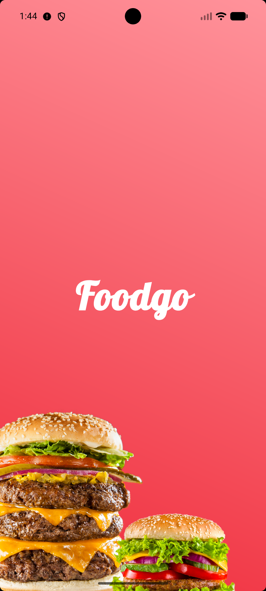
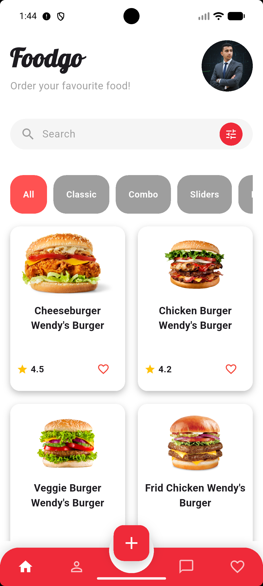
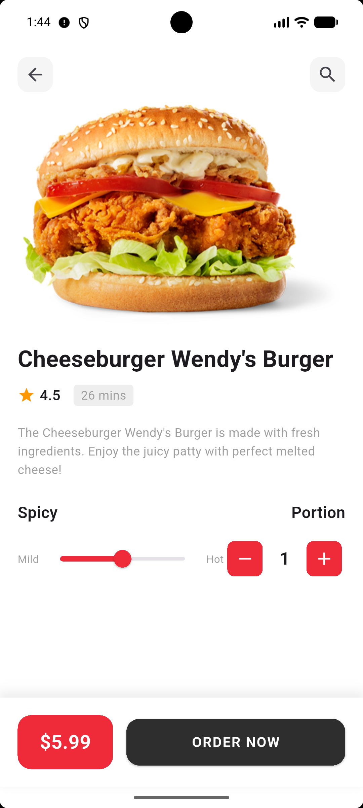
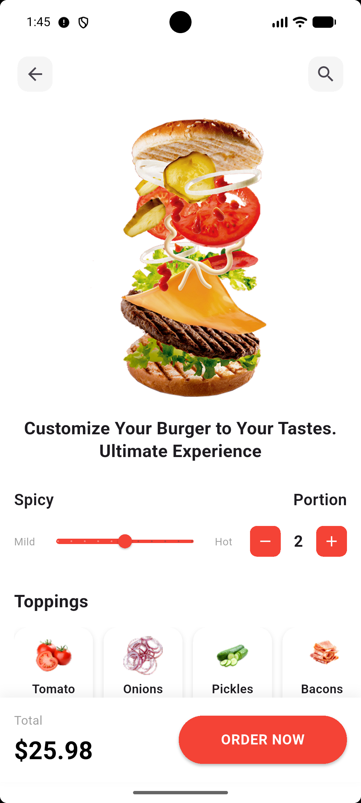
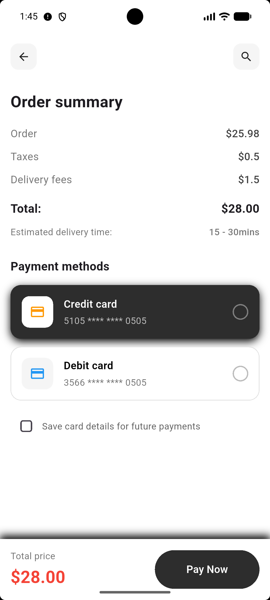
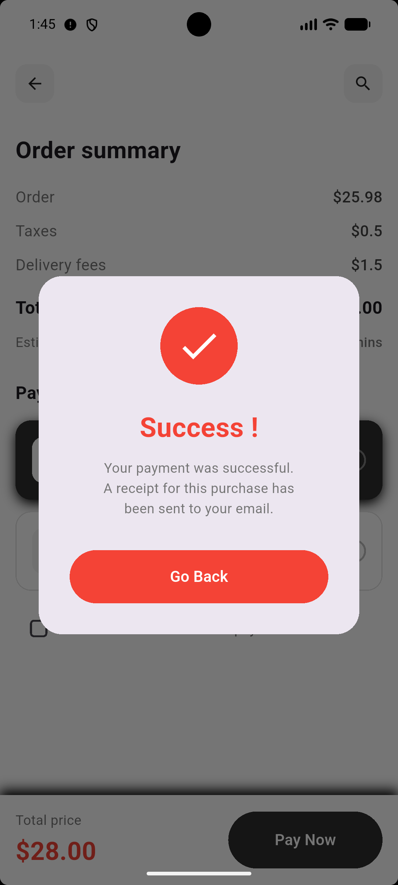

# 🍔 Food App

<div align="center">

  
  
  
  

  **A modern, feature-rich Flutter application for browsing, exploring, and discovering delicious meals.**
  
  [Report Bug](https://github.com/esmail1234/Food-App/issues) · [Request Feature](https://github.com/esmail1234/Food-App/issues)
</div>

---

## 📖 Project Overview

**Food App** is a comprehensive culinary mobile application built with **Flutter**. It allows users to browse a vast variety of meals, explore diverse categories, and view detailed information about every dish.

Designed with a focus on **User Experience (UX)** and **Performance**, the app features a sleek, responsive interface, smooth navigation, and reusable UI components. Whether you are a foodie looking for your next meal or a developer exploring clean Flutter architecture, this project serves as a perfect example of a modern mobile app.

---

## ✨ Features

We've packed this app with everything you need:

- **🏠 Home Screen**
  - Featured meals and daily recommendations.
  - Beautiful UI components with smooth scrolling.

- **📂 Smart Categories**
  - Browse meals by cuisine or type (e.g., Italian, Burgers, Desserts).
  - Intuitive grid layout for easy discovery.

- **🔍 Meal Details**
  - Comprehensive info: Images, Ingredients, Descriptions, and Pricing.
  - High-quality visual representation of dishes.

- **🧭 Seamless Navigation**
  - Fluid screen transitions and easy-to-use user flow.
  - Optimized for a fast and lag-free experience.

- **🎨 UI/UX Design**
  - **Responsive Layout**: Looks great on all screen sizes (Phones & Tablets).
  - **Modern Aesthetics**: Consistent color palette and typography.
  - **Reusable Widgets**: Built with scalability in mind.

---

## 📸 Screenshots

| **Splash Screen** | **Home Screen** | **Meal** |
|:---:|:---:|:---:|
|  |  |  |

| **Meal Details** | **Order Summary** | **Checkout** |
|:---:|:---:|:---:|
|  |  |  |

> *Note: Please ensure your screenshots are placed in the `assets/screenshots/` directory.*

---

## 🛠️ Tech Stack & Tools

This project utilizes a powerful stack of technologies:

- **⚡ Flutter**: Google's UI toolkit for building natively compiled applications.
- **💙 Dart**: The programming language behind Flutter.
- **🏗️ Architecture**: Clean and organized structure separating UI from logic.
- **🎨 UI/UX**: Custom widgets, animations, and responsive layouts.

---

## 🚀 Installation & Getting Started

Follow these steps to run the project locally.

### Prerequisites
- **Flutter SDK**: [Install Flutter](https://flutter.dev/docs/get-started/install)
- **Dart SDK**: Included with Flutter.
- **IDE**: VS Code or Android Studio.

### Steps

1. **Clone the Repository**
    ```bash
    git clone [https://github.com/esmail1234/Food-App.git](https://github.com/esmail1234/Food-App.git)
    cd Food-App
    ```

2. **Install Dependencies**
    ```bash
    flutter pub get
    ```

3. **Run the App**
    ```bash
    flutter run
    ```

---

## 📖 Usage Guide

1. **Open the App**: Launch the application on your emulator or physical device.
2. **Explore**: Use the Home screen to see featured and trending meals.
3. **Browse Categories**: Filter meals by your favorite categories.
4. **View Details**: Click on any meal to see its full description and price.
5. **Enjoy**: Experience a smooth and modern UI designed for food lovers.

---

## 🧠 Engineering Decisions
- **Modularity**: Every component is built to be reusable across different screens.
- **Maintainability**: Clean code practices to ensure easy updates and future expansions.
- **Performance**: Optimized asset loading and widget rendering.

---

## 📈 Future Improvements
- 🔥 **Backend integration** (Firebase / REST API)
- 🛒 **Cart System**: To allow users to order meals.
- ❤️ **Favorites**: Save your preferred dishes for later.
- 🔐 **Authentication**: User accounts and personalized profiles.

---

## 📞 Contact & Support

Created by **Esmail Mohamed** - feel free to contact me!

- **Email**: [em5494282@gmail.com](mailto:em5494282@gmail.com)
- **GitHub**: [github.com/esmail1234](https://github.com/esmail1234)
- **LinkedIn**: [Esmail Mohamed](https://www.linkedin.com/in/esmail-mohamed-a57905282/)
- **WhatsApp**: [+201005267724](https://wa.me/201005267724)

If you found this project helpful, please give it a ⭐️!
